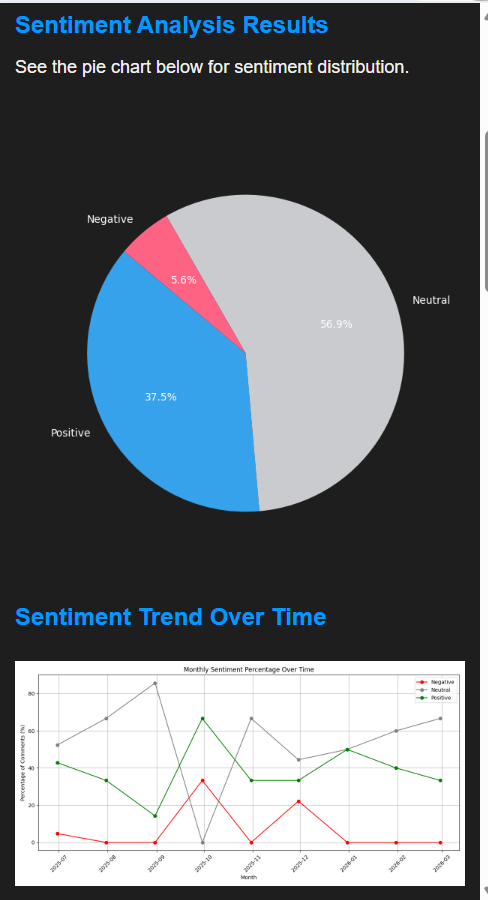
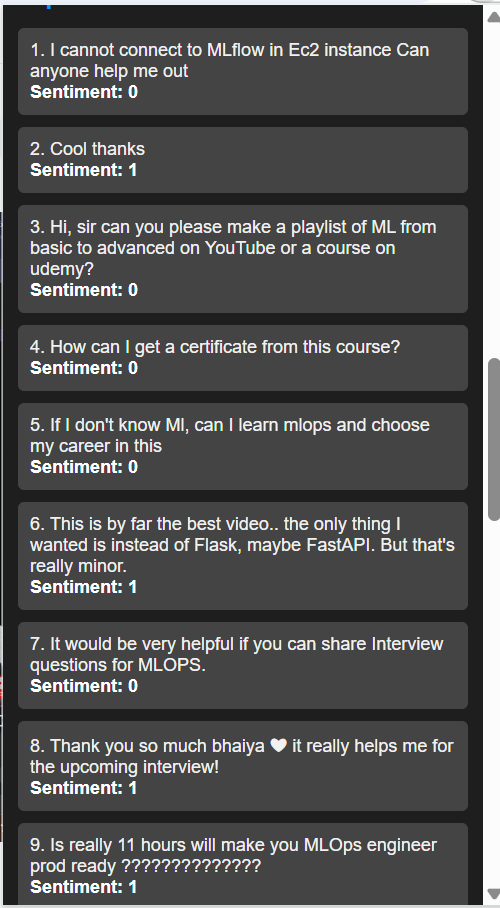
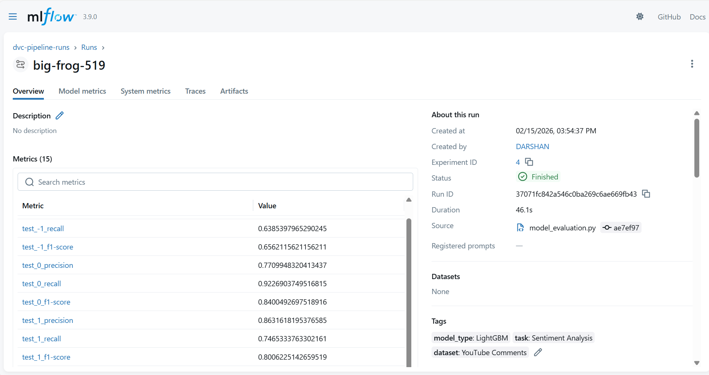
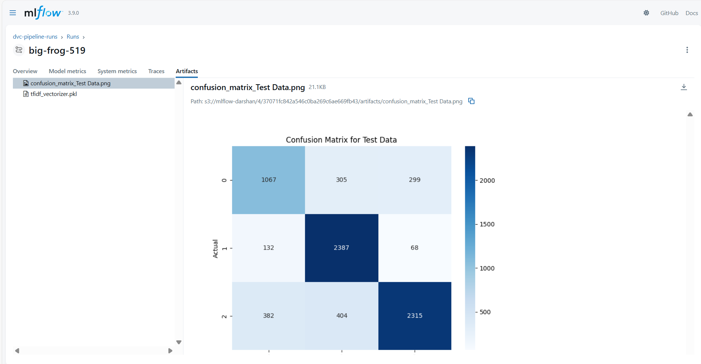
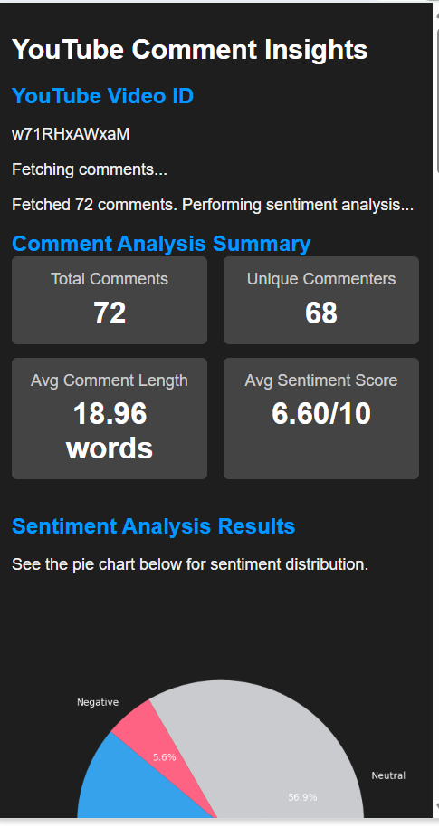

# VibeOps - YouTube Comment Sentiment Analysis

An end-to-end MLOps project that analyzes YouTube video comments for sentiment using Machine Learning. Features a Chrome Extension for real-time sentiment insights directly on YouTube.

---

## Table of Contents

- [Overview](#overview)
- [Features](#features)
- [Architecture](#architecture)
- [Tech Stack](#tech-stack)
- [Project Structure](#project-structure)
- [Getting Started](#getting-started)
- [DVC Pipeline](#dvc-pipeline)
- [MLflow Experiment Tracking](#mlflow-experiment-tracking)
- [Flask API](#flask-api)
- [Chrome Extension](#chrome-extension)
- [CI/CD Pipeline](#cicd-pipeline)
- [Results](#results)

---

## Overview

VibeOps is a complete MLOps solution for sentiment analysis of YouTube comments. The project demonstrates industry-standard practices including:

- **Data Version Control** with DVC
- **Experiment Tracking** with MLflow
- **Model Serving** via Flask API
- **Browser Extension** for end-user interaction
- **Automated CI/CD** with GitHub Actions
- **Containerization** with Docker
- **Cloud Deployment** on AWS

---

## Features

- **Real-time Sentiment Analysis** - Analyze YouTube comments instantly
- **Visual Analytics** - Pie charts, trend graphs, and word clouds
- **LightGBM Model** - High-performance gradient boosting
- **Experiment Tracking** - Full MLflow integration with S3 artifact storage
- **Reproducible Pipelines** - DVC for data and pipeline versioning
- **Containerized Deployment** - Docker + AWS ECR
- **Automated CI/CD** - GitHub Actions for continuous deployment

---

## Architecture

```
┌─────────────────┐     ┌─────────────────┐     ┌─────────────────┐
│  Chrome         │────▶│  Flask API      │────▶│  ML Model       │
│  Extension      │     │  (Prediction)   │     │  (LightGBM)     │
└─────────────────┘     └─────────────────┘     └─────────────────┘
                                                        │
                                                        ▼
┌─────────────────┐     ┌─────────────────┐     ┌─────────────────┐
│  GitHub Actions │────▶│  Docker/ECR     │────▶│  EC2 Instance   │
│  (CI/CD)        │     │  (Container)    │     │  (Deployment)   │
└─────────────────┘     └─────────────────┘     └─────────────────┘
                                                        │
                                                        ▼
┌─────────────────┐     ┌─────────────────┐     ┌─────────────────┐
│  DVC            │────▶│  MLflow         │────▶│  S3 Bucket      │
│  (Pipeline)     │     │  (Tracking)     │     │  (Artifacts)    │
└─────────────────┘     └─────────────────┘     └─────────────────┘
```

---

## Tech Stack

| Category | Technologies |
|----------|-------------|
| **ML/Data** | Python, Pandas, NumPy, Scikit-learn, LightGBM, NLTK |
| **MLOps** | DVC, MLflow, Docker |
| **Backend** | Flask, Flask-CORS |
| **Frontend** | Chrome Extension (HTML, CSS, JavaScript) |
| **Cloud** | AWS EC2, AWS ECR, AWS S3 |
| **CI/CD** | GitHub Actions, Self-hosted Runner |
| **Visualization** | Matplotlib, Seaborn, WordCloud |

---

## Project Structure

```
VibeOps/
├── .dvc/                    # DVC configuration
├── .github/workflows/       # CI/CD pipeline
├── data/
│   ├── raw/                 # Raw dataset
│   └── interim/             # Processed data
├── flask_api/               # Flask API for predictions
│   └── main.py
├── notebook/                # Jupyter notebooks for EDA
├── src/
│   └── model/
│       ├── data_ingestion.py
│       ├── data_preprocessing.py
│       ├── model_building.py
│       ├── model_evaluation.py
│       └── register_model.py
├── yt-chrome-plugin-frontend/  # Chrome Extension
│   ├── manifest.json
│   ├── popup.html
│   └── popup.js
├── Dockerfile
├── dvc.yaml                 # DVC pipeline definition
├── params.yaml              # Model parameters
├── requirements.txt
└── setup.py
```

---

## Getting Started

### Prerequisites

- Python 3.8+
- Git
- Docker (for containerization)
- AWS Account (for deployment)

### Installation

1. **Clone the repository**
```bash
git clone https://github.com/Darshan-1812/VibeOps.git
cd VibeOps
```

2. **Create virtual environment**
```bash
python -m venv venv
source venv/bin/activate  # Linux/Mac
.\venv\Scripts\Activate   # Windows
```

3. **Install dependencies**
```bash
pip install -r requirements.txt
```

4. **Set up environment variables**
```bash
# Create .env file
AWS_ACCESS_KEY_ID=your_access_key
AWS_SECRET_ACCESS_KEY=your_secret_key
AWS_DEFAULT_REGION=us-east-1
```

5. **Run DVC pipeline**
```bash
dvc repro
```

---

## DVC Pipeline

The ML pipeline is managed with DVC for reproducibility:

```yaml
stages:
  data_ingestion:
    cmd: python src/model/data_ingestion.py
    
  data_preprocessing:
    cmd: python src/model/data_preprocessing.py
    
  model_building:
    cmd: python src/model/model_building.py
    
  model_evaluation:
    cmd: python src/model/model_evaluation.py
    
  model_registration:
    cmd: python src/model/register_model.py
```

**Run the pipeline:**
```bash
dvc repro
```

---

## MLflow Experiment Tracking

MLflow tracks all experiments with metrics, parameters, and artifacts stored on S3.

### Tracked Metrics
- Precision, Recall, F1-Score (per class)
- Confusion Matrix
- Model Artifacts

### MLflow Dashboard



*MLflow experiment tracking showing model performance metrics including precision, recall, and F1-scores for each sentiment class.*

### Confusion Matrix



*Confusion matrix visualization for the test data showing model predictions across Negative (0), Neutral (1), and Positive (2) classes.*

---

## Flask API

### Endpoints

| Endpoint | Method | Description |
|----------|--------|-------------|
| `/` | GET | Health check |
| `/predict` | POST | Predict sentiment for comments |
| `/predict_with_timestamps` | POST | Predict with timestamp data |
| `/pie_chart` | POST | Generate sentiment pie chart |
| `/word_cloud` | POST | Generate word cloud image |
| `/sentiment_trend` | POST | Generate sentiment trend graph |

### Example Request

```bash
curl -X POST http://localhost:5000/predict \
  -H "Content-Type: application/json" \
  -d '{"comments": ["This video is amazing!", "Not helpful at all"]}'
```

### Response
```json
[
  {"comment": "This video is amazing!", "sentiment": 1},
  {"comment": "Not helpful at all", "sentiment": -1}
]
```

---

## Chrome Extension

The Chrome Extension provides real-time sentiment analysis for any YouTube video.

### Features
- Comment Analysis Summary
- Sentiment Distribution Pie Chart
- Sentiment Trend Over Time
- Comment Word Cloud
- Individual Comment Sentiments

### Chrome Extension Demo



*Chrome Extension showing comment analysis summary with total comments, unique commenters, average comment length, and sentiment score.*

### Sentiment Analysis Results



*Pie chart showing sentiment distribution - Positive (37.5%), Neutral (56.9%), and Negative (5.6%).*

### Sentiment Trend



*Line graph showing sentiment trends over time with monthly breakdown.*

### Comment Sentiments


*Individual comment sentiment predictions showing text and classified sentiment.*

### Installation

1. Open Chrome → `chrome://extensions/`
2. Enable **Developer mode**
3. Click **Load unpacked**
4. Select the `yt-chrome-plugin-frontend` folder

---

## CI/CD Pipeline

Automated deployment using GitHub Actions with self-hosted runner.

### Pipeline Stages

```
┌──────────────────┐    ┌──────────────────┐    ┌──────────────────┐
│   Continuous     │───▶│   Continuous     │───▶│   Continuous     │
│   Integration    │    │   Delivery       │    │   Deployment     │
│   (Lint & Test)  │    │   (Build & Push) │    │   (Deploy EC2)   │
└──────────────────┘    └──────────────────┘    └──────────────────┘
```

### Workflow

1. **Continuous Integration** - Code linting and unit tests
2. **Continuous Delivery** - Build Docker image and push to AWS ECR
3. **Continuous Deployment** - Pull and run container on EC2 (self-hosted runner)

### Required Secrets

| Secret | Description |
|--------|-------------|
| `AWS_ACCESS_KEY_ID` | AWS Access Key |
| `AWS_SECRET_ACCESS_KEY` | AWS Secret Key |
| `AWS_REGION` | AWS Region (e.g., us-east-1) |
| `ECR_REPOSITORY_NAME` | ECR Repository Name |
| `AWS_ECR_LOGIN_URI` | ECR Login URI |

---

## Results

### Model Performance

| Class | Precision | Recall | F1-Score |
|-------|-----------|--------|----------|
| Negative (-1) | 0.64 | 0.64 | 0.66 |
| Neutral (0) | 0.77 | 0.92 | 0.84 |
| Positive (1) | 0.86 | 0.75 | 0.80 |

### Sample Analysis

- **Total Comments Analyzed**: 72
- **Unique Commenters**: 68
- **Average Sentiment Score**: 6.60/10
- **Sentiment Distribution**: Positive 37.5%, Neutral 56.9%, Negative 5.6%

---

## Contributing

Contributions are welcome! Please feel free to submit a Pull Request.

1. Fork the repository
2. Create your feature branch (`git checkout -b feature/AmazingFeature`)
3. Commit your changes (`git commit -m 'Add some AmazingFeature'`)
4. Push to the branch (`git push origin feature/AmazingFeature`)
5. Open a Pull Request

---

## License

This project is licensed under the MIT License - see the [LICENSE](LICENSE) file for details.

---

## Author

**Darshan Girase**

- GitHub: [@Darshan-1812](https://github.com/Darshan-1812)

---

## Show Your Support

Give a star if this project helped you!
